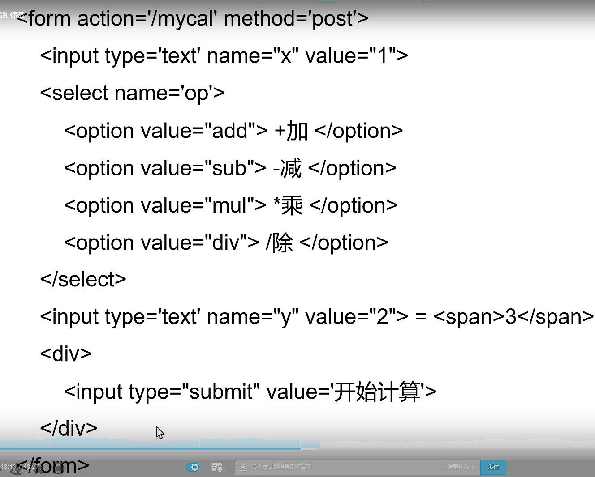

# The first week of learning Django

## [Watching Videos](https://www.bilibili.com/video/BV1vK4y1o7jH?spm_id_from=333.337.search-card.all.click) or [Read Docs](https://docs.djangoproject.com/zh-hans/4.0/contents/)

### 1.1Django介绍

#### 课程介绍

1. 包含大量组件
2. 包含组件
   1. 基本配置/路由系统
   2. 模型/模板/视图
   3. Cookies和Session
   4. 分页及发邮件
   5. Admin管理后台

#### 项目结构

1. 安装配置完毕后,`cd`进入文件夹,终端:`django-admin startproject xxxxx`
2. `cd xxxxx`并`python3 manage.py runserver (port_num)`端口号默认为8000
3. 关闭服务:`sudo lsof -i:8000`查询进程id,`kill -9 id_num`杀死进程[listen]状态
4. 端口已被使用;使用`3`的方式杀死占用端口的进程
5. 文件结构
   1. `manage.py`包含子命令
   2. `wsgi.py`上线时用到
   3. `urls.py`http请求优先调用
   4. `settings.py`项目设置
      1. 共有(官方提供)/自定义配置
      2. `BASE_DIR='xxxx'`变量名必须大写
      3. 不同版本,一些import和代码可能有差别
      4. `ALLOWED_HOSTS = []`请求host头`'*'`表示任何请求头都可以
      5. `TEMPLATES`模板
      6. `LANGUAGE_CODE`为'zh-Hans'为简体中文页面
      7. `TIME_ZONE `时区,`Asian/Shanghai`
      8. 引用方法`from django.conf import settings`

#### URL和视图函数

1. URL的组成:协议,域名,端口号(:),路由,查询(?),锚点(#)

2. django如何处理URL请求

   1. 从配置文件中根据`ROOT_URLCONF`找到主路由文件,通常为同一目录下`url.py`
   2. 加载该文件中`urlpatterns`变量(包含路由的数组)
   3. 匹配
   4. 成功:调用对应视图函数处理
   5. 失败:返回404
   6. 例如:

   ```python
   urlpatterns=[
   	path('admin/',admin.site.urls),
   	#http://127.0.0.1:8000/page/2003/
   	path('page/2003/',views.page_2003)
   ]
   ```

3. 视图函数

   ```
   from django.http import HttpResponse
   def xxx_view(request[,其他参数]):
   	return HttpResponse 对象
   ```

#### 路由配置

1. `path(route.views,name=None)`

2. path转化器:例子`path('page/<int:page>',views.xxx)`

   1. int::0或任何正整数
   2. str:匹配除'/'外非空字符串
   3. slug:短横线相连字符串
   4. path:非空字段,包括'/'
   5. 例子(注意匹配顺序,依次)

   ```
   # 在urls.py文件中,修改urlpatterns
   path('page/<int:pg>/', views.page_n),
   
   #在views.py中,修改,这里pg相当于参数
   def page_n(request,pg):
       html = '%s'%(pg)
       return HttpResponse(html)
   ```

   

3. `re_path(reg,view,name)`正则匹配,格式`(?P<varables_name>regular_pattern)`

   1. 例子(生日)

   ```
   # urls.py
   re_path(r'^birthday/(?P<year>\d{4})/(?P<month>\d{1,2})/(?P<day>\d{1,2})$',views.birthday_view),
   
   # view.py
   def birthday_view(request,year,month,day):
       html="<h1>The birthday is %s/%s/%s<h1>"%(year,month,day)
       return HttpResponse(html)
   ```

4. 注意传参以后数字也变为字符类型

### 2.1请求及响应

1. Http有多种请求方法
   1. Get:请求页面信息
   2. Head:获取报头
   3. Post:提交数据
   4. Put:数据取代内容
   5. Delete:
   6. Connect:管道方式,代理服务器
   7. Options:查看客户端性能
   8. Trace:测试诊断
2. Django中的请求
   1. path_info:string:URL
   2. method:string:请求方式
   3. get/post/files:字典
   4. ....
3. 响应
   1. 状态码(起始行);Headers;Body
      1. 200-请求成功;500-错误;.......
   2. 构造函数格式:
      1. HttpResponse(content响应体,content_type响应体数据类型,status状态码)
      2. HttpResponseRedict('url')跳转指令

### 2.2GET/POST请求

1. 通过`if request.method=='GET'/'POST'`判断请求种类,分类进行处理

2. URL格式:正常域名+('?参数名1=值&参数名2=值&.....')

   1. 如何查询字符串:

   ```
   request.GET['参数名']
   request.GET.get('参数名','默认值') #没有找到指定参数时返回默认值
   request.GET.getlist('参数名'),对于参数的值有多个的情况
   
   # 例子:在views.py中
   def test_get_post(request)
   	if request.method=='GET':
   		print(request.GET['a'])
   ```

3. POST:

   1. `action`:发送目的

   2. ```
      POST_FORM='''
      	<form method='post' action='/test_get_post'>
      		用户名:<input type='text' name='uname'>
      		<input type='submit' value='提交'>
      	</form>
      '''
      ........
      if .....='GET'
      	.....
      	return HttpResponse(POST_FORM)
      elif request.method='POST':
      	print('uname is',request.POST['uname'])
      	return HttpResponse('post is ok')
      	pass
      
      ```

      

   3. csrf验证

      1. 如果想关闭,则注释掉setting.py中MIDDLEWEARE中Csrf相关语句

      

      此时可以按F12查看网络:

      

### 2.3Django的设计模式及模板层

1. 传统:MVC模型(DB的封装)-视图(向用户展示)-控制器(处理请求,获取,返回)

2. Django:MTV:模型(与数据库交互)-模板(如何呈现)[与字典联动]-视图

3. 模板配置:settings.py中TEMPLATES

   1. DIRS(主要):模板的搜索目录

      1. 配制方法:

      ```
      'DIRS':[os.path.join(BASE_DIR,'templates')]
      ```

   2. BACKEND:指定引擎

   3. APP_DIR:是否要在应用里搜索

   4. OPIONS:有关配置

4. 模板的使用

   1. 在父文件夹下创建文件夹templates

      1. 其中存放模板的html文件

   2. 更改DIRS:`'DIRS': [os.path.join(BASE_DIR,'templates')],`

   3. 模板加载方式:

      1. 通过loader获取模板,HttpResponse响应在视图中

          ```
          # views中的函数
          from django.template import loader
          # 加载模板
          t=loader.get_template("模板文件名")
          # 将t转化为HTML字符串
          html=t.render(字典数据)
          return HttpResponse(html)
          ```
          
      2. 使用render()直接加载

          ```
          from django.shortcuts import render
          return render(request,'\模板文件名',字典数据)
          ```

   4. 将变量(字典)传至html中

      ```
      def xxx_view(request)
      	dic={
      		"var":"value",
      		....
      	}
      	return render(request,'xxx.html',dic)
      ```

      

   

### 2.4模板层-变量和标签

1. 能传递的数据类型:

   1. str/int/list/tuple/dict/func/obj

2. 模板中变量语法

   1. {{var_name}}
   2. {{var_name.index}}
   3. {{var_name.key}}
   4. {{obj.method}}
   5. {{func_name}}

3.  

4. 标签:将服务端功能嵌入模板,如流程控制

   1. if标签,在html文件中加载

      ```
      
      	do......
      
      	do......
      
       # 必须加
      ```

   2. 实现运算网页

      1. 先解决一个编辑器的问题

         ```
         IntelliJ IDEA无法输入中文
         ubuntu 20.04 Intelligent Pinyin 1.11.1 IntelliJ IDEA 2020.2.2(Ultimate Edition) 当全拼输入2~3个汉字时，会被强行打断，然后就无法继续输入(也无法切换中英文)，并且汉字下会有下划线。
         该提问来源于开源项目:libpinyin/ibus-libpinyin
         
         1.点击菜单 "Help | Edit Custom VM options..."
         2.添加 -Drecreate.x11.input.method=true 到最后一行
         3.重启IDEA
         
         来自https://bbs.csdn.net/topics/397173456
         ```

      2. 代码实现

         1. mvcal.html:

            ```html
            <form action='/mycal' method='post'>
                <input type='text' name="x" value="{{x}}">
                <select name='op'>
                    <option value="add"> +add</option>
                    <option value="sub"> -sub</option>
                    <option value="mul"> *mul</option>
                    <option value="div"> /div</option>
                </select>
                <input type='text' name="y" value="{{y}}"> = <span>{{result}}</span>
                <div><input type="submit" value='start cal'></div>
            </form>	
            ----------------------------------------------------------
            # 修改部分:为了让选项卡记住状态
             <option value="add" selected> +add</option>
                    <option value="sub" selected> -sub</option>
                    <option value="mul" selected> *mul</option>
                    <option value="div" selected> /div</option>
            # 可能报错,不用管
            ```

         2. views.py

            ```python
            def test_mycal(request):
                if request.method == 'GET':
                    return render(request, 'mycal.html')
                elif request.method == 'POST':
                    x =int( request.POST['x'])
                    y =int( request.POST['y'])
                    op = request.POST['op']
                    # 要注意x,y傳入的數據需要可運算，可判斷或強制類型轉換
                    result = 0
                    if op == 'add':
                        result = x + y
                    elif op == 'sub':
                        result = x - y
                    elif op == 'mul':
                        result = x * y
                    elif op == 'div':
                        result = x / y
                    else:
                        pass
                    return render(request, 'mycal.html', locals())
                    # loacal()可以直接將數據封裝成字典，等同於自己創建dic
            ```

   3. for标签

      ```
      
      	....(cir)
      
      	.....(obj无数据时)
      
      ```

      1. 内置变量`forloop`

      2. 一个简单样例:

         ```
         
         	{{name}}
         
         	list 中无数据
         
         ```

### 2.5模板层-过滤器和继承

1. 过滤器:变量输出时处理

   1. 语法:`{{var | filter:'parameter'|filter2:'parameter'....}}`
   2. 常用:
      1. lower/upper:转化大小写.
      2. safe:不进行html转义
      3. add:"n":加n运算

2. 继承:父模板的内容重用

   1. block:定义可修改部分

   2. 继承模板extends标签(写在模板文件的第一行).如:``

   3. 子模板重写:

      ```
      
      
      ```

   4. 继承时无法取得父模板中的变量值

### 2.6url反向解析

1. 出现位置:

   1. html中:超链接,
   2. views函数中,例如:HttpResponseRedirect(url)

2. 书写规范:

   1. 绝对地址:常见的
   2. 相对地址:'/site' 当前页面url(注意是源)+site;不带斜杠的,找最后斜杠的前面所有地址

3. 可以用path定义的名称动态查找或计算相应路由

   1. `path(route,views,name="别名")`
   2. `path('page',views.page_view,name="page_url")`
   3. 例子:

   ```
   
   
   ```

   1. 不需要更改html文件中数据

4. 调用reverse方法

   ```
   from django.urls import reverse
   url=reverse('别名'，args=[] , kwargs={})
   ex:
   print(reverse('pagen',args=[300]))
   print(reverse('person',kwargs={'name':'xixi',age':18}))
   ```

### 3.1静态文件

1. 配置:默认访问路径:`STATIC_URL='/static/'`;访问时通过`http://127.0.0.1:8000/static/xxx`
2. 配置文件的存储路径:`STATICFILES_DIRS=(os.path.join(BASE_DIR,"static"))`
3. 在mysite3下创建static文件夹,存放静态资源文件
4. 关于引用
   1. 绝对地址/相对地址
   2. 通过标签访问
      1. 加载:
      2. 使用资源
      3. 样例:``
      4. 无论STATIC_URL如何改变,这种方式不会受影响

### 3.2Django应用和分布式路由

1. 应用:独立的业务模块
   1. 步骤:
      1. 执行:`python manage.py startapp app_name`
      2. 在settings.py中ISTALLED_APPS添加自己的应用
2. 分布式路由
   1. 在urls.py中不再处理具体路由,做请求的分应用分发
   2. 步骤:`path('music/',include('music.urls'))`
   3. 在应用中创建urls.py,添加urlpatterns,`path('index',view)`中index只用写余下部分
   4.  配置模板目录需要自己创建应用路径下的templates文件,会先找外层的模板,后找应用内的,若有APPS配置下前应用内有同名模板,也会出错
   5. 要解决上述问题,在templates文件夹中增加新文件夹(不要和其他templates中文件夹同名了),并在views调用时增加此路径

### 3.3模型层ORM

1. 安装`mysqlclient`;前提:`sudo apt-get install python3-dev default-libmysqlclient-dev`

2. 进入mysql先建数据库(通常与项目名一致)

3. 更改settings中DATABASES

4. 模型是python中的一个类

5. ORM:对象关系映射,使用类和对象对数据库操作(有性能损失)

6. 数据库迁移:将同步对模型的操作到数据库

   1. 生成迁移文件`pyhon manage.py makemigrations`因为使用mysql 现在在win10上操作
   2. 执行迁移脚本程序`python manage.py migrate`
   3. 模型类的创建:

   ```
   from django.db import models
   class Models_name(models.Model):
       字段名 = models.字段类型(设置)
   ```

### 3.4/5ORM基础字段及选项

- BooleanField():python中true/false;DB中0/1
- CharField
- DateField:表示日期,auto_now=true显示实时,default默认[三选一]
- DecimalField
- EmailField:varchar[通过正则检查]
- ImageField:varchar存储图片路径
- TextField:longtext

### 3.6基本操作-创建数据 

1. 新增字段必须要default选项 
2. Meta类,定义:给模型提供属性
3. 基本操作:增删改查(核心:模型类.管理器对象)
4. 创建
   1. 方案1:`MymModel.objects.create(var=value,....)`
   2. 方案2:`obj=Mymodel(var=value,...)     obj.save()`save之后才会入库
5. Django shell:`python3 manage.py shell`代码有变化,需重启才会变

### 4.1查询操作

1. 方法多(稍后可在技术文档找全打表放在下方)

2. 在模型类中定义`_str_`方法,自定义QuerySet的输出模式

   ```
   def _str_(self):
   	return '%s_%s_%s_%s'%(self.title,self.price,self.pub.....)
   ```

3. 我并不是来学这些细节的,所以略过,有需要看:https://segmentfault.com/a/11900000170032 or https://zhuanlan.zhihu.com/p/74423815

4. 双下划线(__)之单表条件查询,例子:

   ```text
   table1.objects.filter(id__lt=10,id__gt=1)#获取id小于10,且大于1的记录
   table1.objects.filter(id__in=[11,22,33,44])#获取id在[11,22,33,44]中的记录
   table1.objects.exclude(id__in=[11,22,33,44])#获取id不在[11,22,33,44]中的记录
   table1.objects.filter(name__contains="content1")#获取name中包含有"contents"的记录(区分大小写)
   table1.objects.filter(name__icontains="content1")#获取name中包含有"content1"的记录(不区分大小写)
    
   table1.objects.filter(id__range=[1,4])#获取id在1到4(不包含4)之间的的记录
   ```

### 4.2更新操作(详见上文链接)

1. disabled属性:可否更改
2. 可以通过for循环实现表格输出


### 4.3数据删除

1. 一般都是伪删除,具体方法参考上文链接

### 4.4F/Q对象

1. F对象:专门取对象中某列值的操作
2. 有锁的功能,不是置数而是直接运算
3. Q对象:使用逻辑条件时使用,`Q(condition)logicalcaluQ(condition)`

### 4.5聚合查询与原生数据库操作

1. 一般不用原生,可能会有sql注入攻击:`MyModel.objects.raw(sql)`
2. 聚合查询:
   1. 整表:
      1. 导入:`from django.db.models import *`
      2. 聚合函数:Sum,Avg,Count,Max,Min
      3. 语法:`MyModels.objects.aggregate(var=func('list'))`
      4. 返回:结果变量名:值组成的字典
   2. 分组
      1. 语法:`QuerySet.annotate(var=func('list'))`
      2. 返回:QuerySet

### 5.1Admin后台管理

1. 配置步骤:`python manage.py createsuperuser

2. 在后台管理显示自己定义的模型类:

   1. 在app中admin.py中导入注册要用的models类
   2. 调用admin.site.register注册

3. ```
   def __str__(self):
       return '%s_%s_%s'%(self.title,self.price,self.info)	# 显示时格式,下划线可以改成其他符号
   ```

4. 模型管理类:

   1. 继承django.contrib.admin中的类
   2. 在admin.py中定义模型管理类
   3. 与模型绑定`admin.site.register(Models,Manager)`现在就有了表头,不用再加5.1.3的内容了

   

5. 添加过滤器,搜索框:

   1. ```
      list_display_links = ['title']	#控制list_display中字段,那些可以了链接到修改页面(与过滤无关)
      list_filter = ['price']	#过滤器
      search_fields = ['title'] #对title进行搜索
      ```

6. 添加可在列表页添加的字段:`list.editable=[]`

7. Meta内嵌类:

   1. 例如,在models文件中的Book类下嵌入:

      ```
      class Meta:
      	verbose='图书'	#修改/admin页面中模型的名称
      	verbose_name_plural='复数名'	#这里可以直接与verbose相等,则不会有变化(后面不加s)
      ```

   ### 5.3关系映射(需要再看一些例子)

   1. 一对一:

      1. 语法:`OneToOneField(类名,ondelete=xxx)`级联删除属性必填

         1. models.CASCADE,删除包括ForeingKey的对象
         2. .PROTECT抛出异常,阻止删除
         3. 注意新建了app后migrate步骤不可缺少

      2. 有外键绑定:

         1. 类属性:author
         2. 字段名绑定:author_id

      3. 正向查询:通过外键属性查询

         1. 例如:

            ```
            from .models import wife
            wife = wife.objects.get(name='王夫人')
            print(wife.name,'的老公是',wife
            .author.name)
            ```

      4. 反向查询:

         1. author1=Author.objects.get(name='王老师')

   2. 一对多:

      1. 先创建'一'再创建'多'

      ```
      from .models import *
      publ = Publisher.objects.create(name='清华大学出版社')
      Book.objects.create(title='C++',publisher=pub1)
      Book.objects.create(title='Java', publisher_id=1)
      ```

      2. 注意,要在'多'的类中添加外键:例如`book=models.ForeignKey(Book)`

   3. 多对多:

      1. 需要创建第三张表(会自动生成)
      2. 在其中任意一个类中增加:`属性=models.ManyToManyField()`

   ### 5.4Cookies和session

   1. 保持会话状态的存储技术

   2. cookies:保存在浏览器客户端上,键值对存储,有生命周期

   3. 每次访问时都会传回浏览器

   4. Cookies的使用

      1. 存储:`HttpResponse.set_cookies(key,value='',max_age=,expires=)`

      2. 在views.py中添加以下代码,并在urls中配置

         ```
         def set_cookies(request)
         	resp=HttpResponse('set cookies down')
         	resp.set_cookie('uname','gxn',500)
         	return 
         ```
         
      3. 删除:`HttpResponse.delete_cookie(key)`
   
4. 获取:`value=request.COOKIES.get('cookies名',默认值)`
   
   
   
      
   
    
   
      5. session是在服务器上开辟一段空间用于保留浏览器和服务器交互时 的重要数据 实现方式 
         1. 使用session需要在浏览器客户端启动cookie,且在cookie中 存储 sessionid -每个客户端都可以在服务器端有一个独立的Session 
         2. 注意：不同的请求者之间不会共享这个数据，与请求者一一对 应
      6. 在settings中,APPS中添加`Django.contrib.sessions`;MIDDLEWARE中添加`Django.contrib.middleware.SessionMiddleware`
         7. session对于象是一个类似于字典的Sessionstore类型的对象,可以用类似于字典的方式进行操作 session能够存储如字符串,整型,字典,列表等.
                  1. 保存session的值到服务器 `request.session['KEY'] = VALUE`
                  2. 获取session的值 `value = request.session['KEY'] value = request.session.get('KEY',默认值)` 
                  3. 删除session`del request.session['KEY']`   
      8. settings.py中相关配置项 
            1. SESSION COOKIE AGE 作用指定sessionid在cookies中的保存时长（默认是2周），如下： 例如：`SESSION_COOKIE_AGE = 60 * 60 * 24 * 7 * 2`
            2. `SESSION EXPIRE AT BROWSER CLOSE = True `设置只要浏览器关闭时,session就失效（默认为False） 注意：Django中的session数据存储在数据库中，所以使用session 前需要确保已经执行过migrate
            3. djangoLsession表是提表设计；且该表数据量持续增持【浏览器故意删掉sessionid&过期数据未删除】 
            4. 可以每晚执行`python3 manage.py clearsessions`该命令可删除 已过期的session数据］(若非如此,会恒增)
   
   
   
   ## 第一周总结
   
   ### 到了后面实在不想动手了,主要是开着快进
   
   大部分应该能上手用了,偶尔可以看看文字说明,帮助记忆
   
   


